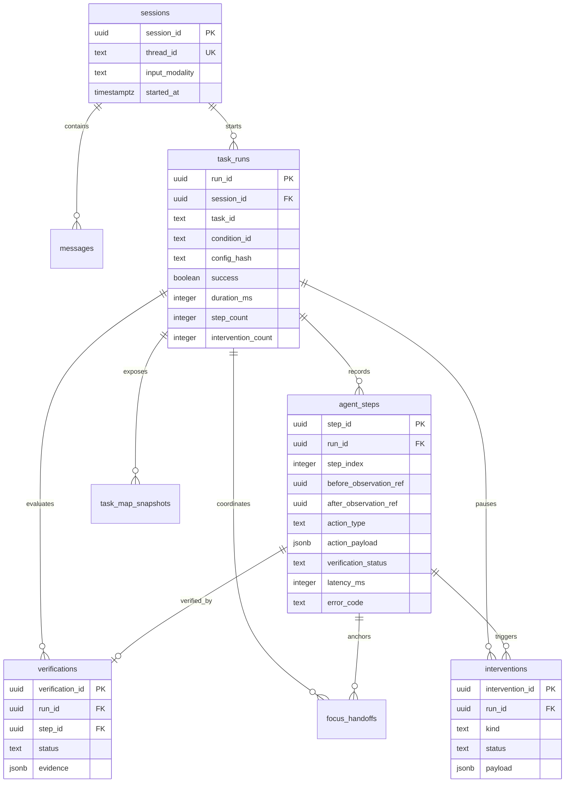

# Tahap 6 — ERD audit dan checkpoint

Tabel checkpoint milik `langgraph-checkpoint-postgres` dibuat melalui
`PostgresSaver.setup()`. Tabel itu sengaja tidak diubah oleh migration riset agar
tetap mengikuti kontrak adaptor resmi. Korelasi dilakukan dengan
`sessions.thread_id` yang juga dipakai sebagai `configurable.thread_id` LangGraph.

Migration riset bersifat versioned:

- Up: `packages/agent/migrations/001_stage6_up.sql`
- Down: `packages/agent/migrations/001_stage6_down.sql`
- Adaptor: `packages/agent/persistence.py`
